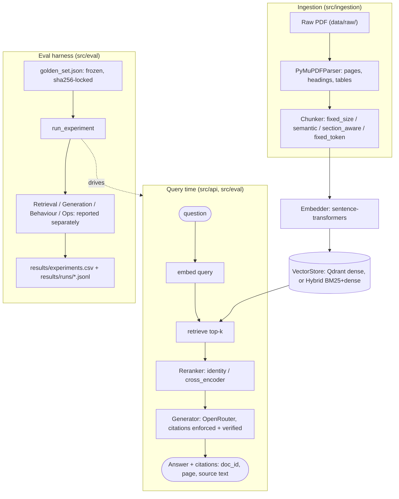

# RAG System with Rigorous Evaluation

A retrieval-augmented question-answering system over the EU AI Act
(Regulation (EU) 2024/1689), built around one idea: **the evaluation
harness is the product, not the chatbot.** Every architecture decision
below was kept or discarded because a number moved — not because an answer
"felt" better.

## Results

Every row below ran the same frozen 18-question golden set (hash
`a16d0944...`, `simple` question type only — see [Limitations](#what-id-do-next)),
the same generator (`openai/gpt-4o-mini`), the same embedder
(`all-MiniLM-L6-v2`). Numbers are copied directly out of
[`results/experiments.csv`](results/experiments.csv) — nothing here is
rounded favorably or invented, including the row that failed. (The golden
set is small and `simple`-only for now — see "What I learned / what I'd do
next" below.)

| Run | Retrieval | Reranker | recall@1 | recall@3 | recall@5 | recall@10 | MRR | Faithfulness | Answer Relevance | Citation Validity | p50 latency | p95 latency | Cost/query |
|---|---|---|--:|--:|--:|--:|--:|--:|--:|--:|--:|--:|--:|
| `baseline` | dense (bi-encoder) | none | 72.2% | 72.2% | 77.8% | 77.8% | 0.736 | 0.889 | 0.889 | *not tracked yet* | 2.08s | 7.02s | $0.000231 |
| `reranked` | dense | cross-encoder | 72.2% | 77.8% | 77.8% | 77.8% | 0.750 | 0.917 | 0.889 | *not tracked yet* | 2.46s | 4.61s | $0.000241 |
| `hybrid` (v1) | BM25 + dense | none | 88.9% | 94.4% | 94.4% | 94.4% | 0.917 | 1.000 | 1.000 | *not tracked yet* | 1.85s | 3.18s | $0.000235 |
| `hybrid` (v2) ⚠️ | BM25 + dense | none | 88.9% | 94.4% | 94.4% | 94.4% | 0.917 | 1.000 | 1.000 | **0.0%** | 1.83s | 3.48s | $0.000252 |
| `hybrid` (v3, fixed) | BM25 + dense | none | 88.9% | 94.4% | 94.4% | 94.4% | 0.917 | 1.000 | 1.000 | **100.0%** | 1.56s | 3.50s | $0.000273 |

*Behaviour metrics (`refusal_accuracy`) are blank for every run — the
golden set has zero `unanswerable`-type questions yet, so there's nothing
for that metric to measure. The column exists in the harness
([`src/eval/behaviour_metrics.py`](src/eval/behaviour_metrics.py)); it's an
honest gap, not a hidden one.*

### Row v2 is a real regression the harness caught, not a hypothetical

Adding stricter citation-enforcement instructions to the generation prompt
included one illustrative example — `[c1]` — that didn't resemble this
project's actual chunk-id format (`eu-ai-act-2024-1689-p92-c0`). The model
quietly started citing fake short IDs instead of the real ones it was
shown. **Every other metric stayed identical between v1, v2, and v3** —
recall, MRR, faithfulness, and answer relevance never moved, because none
of them check whether a citation is real. Only `citation_validity_rate` —
built specifically because "the answer is grounded" and "the answer cites
its actual sources" are different claims — caught it: 0.0% valid, 25
fabricated markers, 0 real ones, buried inside an otherwise perfect-looking
row. Fixed the prompt (dropped the toy example, described the real ID
shape, warned explicitly against short generic-looking ones), reran:
100.0%, 25/25 real. See `git log --oneline` for the fix.

## The problem, and why evaluation-first matters for RAG

A RAG pipeline has a lot of knobs — chunking strategy, embedding model,
retrieval mechanism, reranking, the generation prompt — and almost every
one of them has a plausible-sounding justification for changing it. The
trouble is that "plausible-sounding" and "actually better for this corpus
and these questions" are frequently different things, and a RAG system
fails in ways that look identical from the outside: a wrong or vague
answer could be a retrieval failure, a generation failure, or both, and
you cannot tell which just by reading the output.

This project treats that as the central engineering problem, not an
afterthought. Concretely:

- **Retrieval and generation metrics are computed and reported
  separately, always** (see `CLAUDE.md`) — recall@k and MRR never get
  blended with faithfulness or answer relevance into one "quality score."
  A change that helps retrieval but hurts generation (or vice versa) has
  to show up as two numbers moving in different directions, not one number
  that's ambiguous about which stage changed.
- **Chunking, embedding, retrieval, and reranking are swappable modules
  behind stable interfaces** (`src/ingestion/protocols.py`,
  `src/retrieval/protocols.py`), selected per-experiment by a YAML config
  in `configs/` — never by editing code. Comparing `baseline.yaml` against
  `hybrid.yaml` is a one-line config diff, not a branch.
- **The results above are the actual evidence for this approach.**
  Reranking alone (`reranked`) was a small, safe win: MRR +0.014,
  faithfulness +0.028. Hybrid retrieval was transformative: recall@1
  +16.7pp, recall@3 +22.2pp, faithfulness and answer relevance both hit
  1.000. Guessing which lever mattered more, or shipping either one on
  vibes, would have been a coin flip — the four zero-recall questions in
  `baseline` were specifically named-entity and regulation-number lookups
  ("What is the purpose of Regulation (EU) 2019/816?"), exactly what dense
  embeddings are structurally bad at and BM25 is built for. That diagnosis
  came from reading `results/runs/baseline_*.jsonl` per-question, not from
  a hunch.
- **The v2 citation regression above is the sharpest evidence of all.**
  A change that made every existing metric look unchanged (or better) was
  silently 0% correct on a dimension nothing else was measuring. The fix
  wasn't "try a different prompt and eyeball a few answers" — it was "the
  metric designed for exactly this failure mode caught it in the first
  real run."

## Architecture

Every box on the query-time path is a `Protocol` with at least one
concrete implementation, selected per-experiment from a `configs/*.yaml`
file — `src/eval/registry.py` is the single place that maps a config's
`type: <name>` strings to classes. `src/api/app.py` (the live FastAPI
service) and `src/eval/runner.py` (the eval harness) both build the exact
same pipeline from the exact same config format; the only difference is
what they do with it afterward.

## What I learned / what I'd do next

**What worked:**
- Hybrid retrieval (BM25 + dense, linearly fused) fixed a specific,
  diagnosed failure mode — exact-term and regulation-number lookups —
  that neither dense retrieval nor reranking-on-top-of-dense-retrieval
  could touch, because a reranker can only reorder what retrieval already
  found; it can't reach past a pool that never contained the right chunk.
- A metric built for one specific failure mode (citation validity) caught
  a real bug that every other metric missed entirely. That's the whole
  argument for measuring more than one thing.
- Matching golden-set ground truth by `(doc_id, page)` instead of
  `chunk_id` (`src/eval/golden_set.py`) means the same 18 questions can
  grade a config using any chunker without being rewritten — untested
  across chunkers in the results above (every run here used `fixed_size`),
  but the design decision is already paid for.

**Known limitations, honestly:**
- **18 questions, all `question_type: simple`.** No `multi_hop`,
  `unanswerable`, or `distractor` items yet, so `refusal_accuracy` has
  nothing to measure and there's no signal on multi-source questions or
  deliberately-similar-but-wrong distractor chunks. The schema
  (`src/eval/golden_set.py`) already supports all four types — building
  more hard cases is the highest-leverage next step, not new code.
  18 items is also small enough that any single question flipping moves
  a metric by 5.6 percentage points — worth more data before trusting
  small deltas between close configs.
- **Only `fixed_size` chunking has been compared end-to-end.**
  `semantic` and `section_aware` chunkers exist and are wired into every
  entry point, but there's no results row for either yet — a natural next
  experiment, especially since section-aware chunking might specifically
  help the kind of "what does Article N require" questions this corpus is
  full of.
- **Hybrid retrieval + cross-encoder reranking together hasn't been
  tried.** Reranking alone was a marginal win on top of dense retrieval;
  whether it adds anything on top of hybrid (which already fixed most of
  the actual misses) is an open question, not an assumption either way.
- **Single document.** Everything above is the EU AI Act alone — chunking
  and retrieval choices that work well on one dense legal document don't
  automatically generalize to a multi-document, mixed-format corpus.
- **The live API re-embeds the whole corpus on every cold start**
  (`src/api/app.py`) rather than using a persistent index — fine at ~850
  chunks, a real cost at scale. `DEPLOY.md` covers the tradeoff and the
  fix (persistent Qdrant + a separate one-time ingestion step).
